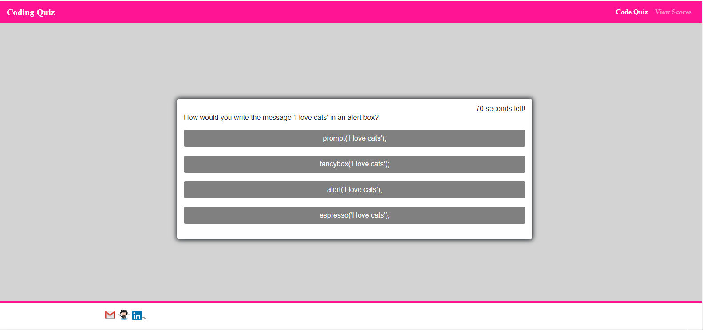

# Code Quiz

## Description

I have created a short quiz about coding in JavaScript to test the knowledge of the user. The user presses a Start button to begin. They then click on an answer and receive feedback and see the correct answer. After all questions have been answered, the user can see and post their score.

<https://melindawinter.github.io/code-quiz/>

## Credits

Thank you to my boot camp instructor, Joe Tanksley, and TA, Adam Abundis. They very patiently helped me work through some fundamental issues with my code during office hours. Thanks to Thor Nolan, my tutor, who helped me figure out how to ge the feedback and scoring element of the quiz working. Thank you to Jeanette Hernandez for a very productive collaboration session on this project and Kate An, Cyrus Jose, and Kevin Cabe.

While figuring out how I wanted the quiz to function, I looked up YouTube tutorials on building a quiz with JavaScript. I found this tutorial really helpful for building out the style aspects: <https://youtu.be/riDzcEQbX6k>. I relied heavily on our boot camp classwork assignments and also looked up many concepts on W3 Schools, Codecademy, Stack Overflow, and freeCodeCamp.

## License

I chose a permissive GNU license for this project, so that others can use and modify the code for their own purposes, but the source code cannot become proprietary and changes must be documented. The file name is COPYING as per GNU convention.## License.
